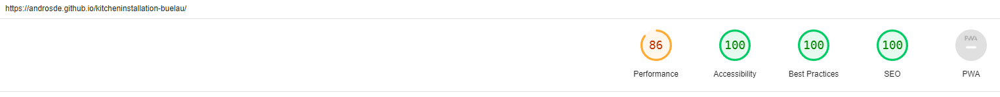
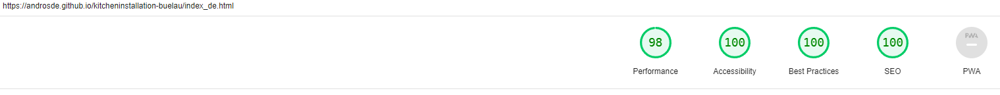

<h1 align="center"> Website Kitchen Installation Bülau </h1>

<h3>Welcome!</h3>

<h3> 
  This is the marketing website for the company "KMB": Küchenmontage Bülau (German) or Kitchen Installation Bülau (English). The aim is to present what kind of services the company offers and in which region the company is active, show-casing some of the finished projects and providing a contact form.
  It is designed to be responsibe and accessible on a range of devices, making it easy to use for potential customers.
</h3>

<h2 align="center"></h2>

[View the live project here.](#)

[View the previous company website here. (Was created by the owner with a website builder tool kit)](https://kuechenmontage-buelau.de/)

## User Experience (UX)
- ### Customer Focus
  1. The visitor needs to be able to easily navigate the site to find the (for the customer) important content.
  2. The visitor needs to be able to easily find the contact information.
  3. The visitor needs to be able to easily find a shop.
  4. The visitor needs to be able to be inspired.

- ### Design
  - #### Color Scheme
    - The two main colors used by Küchenmontage Bülau are black and green.

  - #### Typography
    - The "Fjalla One" and "Quicksand" are used on the previous company [website](https://kuechenmontage-buelau.de/). As these fonts were readable and clean, they were used on this new site as well.

  - #### Imagery
    - Imagery is important, hence the background picture, as well as the header and navigation background are depicting a kitchen, to frame the content in an appropriate non-intrusive way.
    - The gallery is a new addition and showcases different kinds of kitchens. The intent is to display the companies craftsmanship and to provide inspiration on what kind of kitchen to purchase. Therefore the focus is on completely installed kitchens.

- ### Wireframe
  - Home Page Wireframe - [View](https://github.com/AndrosDe/kitcheninstallation-buelau/tree/main/assets/images/Screenshots/kmb_wireframe1.png)
   
  As the other pages were much  simpler in layout only the home page has a Wireframe.

## Features
- ### Existing Features
  - #### Dual Language Support
  - #### Navigation Bar
  - #### The main page image
  - #### Buissness Links
  - #### Service Section
  - #### Contact Form
  - #### Footer
  - #### Gallery
  - #### Impressum
  - #### Legal
  - #### Mobil Phone Support

- ### Features Left to Implement
  - #### Database
  - #### Navigation Bar - Text to Icon

## Technologies Used
- ### Languages Used
  -  [HTML5](https://en.wikipedia.org/wiki/HTML5)
  -  [CSS3](https://en.wikipedia.org/wiki/Cascading_Style_Sheets)

- ### Frameworks, Libraries & Programs Used
  1. [Google Fonts:](https://fonts.google.com/) - Google fonts were used to import the "Fjalla One" and "Quicksand" font into the style.css file which is used on all pages throughout the project.
  1. [Font Awesome:](https://fontawesome.com/) - Font Awesome was used on all pages throughout the website to add icons for aesthetic and UX purposes.
  1. [Git](https://git-scm.com/) - Git was used for version control by utilizing the [Gitpod](https://gitpod.io/) terminal to commit to Git and Push to GitHub.
  1. [GitHub:](https://github.com/) - GitHub is used to store the projects code after being pushed from Git.
  1. [Balsamiq:](https://balsamiq.com/) - Balsamiq was used to create the [wireframes](https://github.com/) during the design process.
  1. [WEBP Converter:](https://www.onlineconverter.com/webp) - WEBP Converter was used to change *.jpg files to *.webp to reduce size 
  1. [MAKEBACKGROUND.IO:](https://makebackground.io/) - MAKEBACKGROUND:IO was used to create an animated footer background
  1. [Contrast Grid:](https://contrast-grid.eightshapes.com/?version=1.1.0&background-colors=&foreground-colors=%23FFFFFF%2C%20White%0D%0A%23F2F2F2%0D%0A%23DDDDDD%0D%0A%23CCCCCC%0D%0A%23888888%0D%0A%23404040%2C%20Charcoal%0D%0A%23000000%2C%20Black%0D%0A%232F78C5%2C%20Effective%20on%20Extremes%0D%0A%230F60B6%2C%20Effective%20on%20Lights%0D%0A%23398EEA%2C%20Ineffective%0D%0A&es-color-form__tile-size=compact&es-color-form__show-contrast=aaa&es-color-form__show-contrast=aa&es-color-form__show-contrast=aa18&es-color-form__show-contrast=dnp) - Contrast Grit was used to find the correct shade of green for the website
  1. [tinypng:](https://tinypng.com/) - Tinypng was used to reduce the file size of pictures
  1. [Paint 3D:](https://www.microsoft.com/de-de/p/paint-3d/9nblggh5fv99?activetab=pivot:overviewtab) - Paint 3D was used to work on the pictures
  1. [Responsinator:](http://www.responsinator.com/) - Responsinator was used to review the website on different resolutions
  1. [Grammarly:](https://app.grammarly.com/) - Grammarly was used for spell checking
  1. [Notepad++:](https://notepad-plus-plus.org/) - Notepad++ for keeping notes for the project

## Testing

The W3C Markup Validator and W3C CSS Validator Services were used to validate every page of the project to ensure there were no syntax errors in the project.

-   [W3C Markup Validator](#)
-   [W3C CSS Validator](#)

The Lighthouse extention was used to validate the performance, accssesability, best pratices and SEO of the project
-   [Lighthouse](https://developers.google.com/web/tools/lighthouse/)
  - Score for index.html
    - Desktop
      <h3></h3>
    - Mobile
      <h3></h3>
  - Score for index_de.html
    - Desktop
      <h3></h3>
    - Mobile
      <h3></h3>
  - Score for gallery.html
    - Desktop
      <h3></h3>
    - Mobile
      <h3></h3>
  - Score for gallery_de.html
    - Desktop
      <h3></h3>
    - Mobile
      <h3></h3>
  - Score for impressum.html
    - Desktop
      <h3></h3>
    - Mobile
      <h3></h3>
  - Score for impressum_de.html
    - Desktop
      <h3></h3>
    - Mobile
      <h3></h3>
  - Score for legal.html
    - Desktop
      <h3></h3>
    - Mobile
      <h3></h3>
  - Score for legal.de
    - Desktop
      <h3></h3>
    - Mobile
      <h3></h3>

### Testing the User Experience (UX)
- Friends and family members were asked to review the site:
  - The gallery was well received and would be of great interest to customers looking for a new kitchen.
  - The contact information is clear and easy to find.
  - Information about the company is easy to find.
  - Legal and Impressum are less easy to find, though 98% of all visitors would not care for them.

### Further Testing
-  The Website was tested on Brave, Google Chrome, Internet Explorer, Microsoft Edge, and Safari browsers.
-  The Website was viewed on Responsinator to emulate: iPhone eXpensive, Android (Pixel 2), iPhone 6-8, iPhone 6-8 Plump, iPad
-  A large amount of testing was done to ensure that all pages were linking correctly.

### Known Bugs
- The navigation menu in the header can only show the website "Home" and "Gallery" with an underline, as well as the current language, "Services" and contact will not have a permanent marking as they are part of the home page. The link will work and direct the visitor to the section on the page though.
- on resolutions lower than 280px width a white gap can be seen to the right of the page. As the page is not meant to be viewed on a screen that small, no additional media queries were made to fix this, as the site becomes unreadable at that resolution anyway.
- the gallery site will take time to load since there are a lot of pictures this is to be excepted. Lowering the resolution would cause the quality of the pictures to deteriorate too much.

## Deployment

### GitHub Pages

The project was deployed to GitHub Pages using the following steps...

1. Log in to GitHub and locate the [GitHub Repository](https://github.com/)
2. At the top of the Repository (not the top of the page), locate the "Settings" button on the menu.
    - Alternatively, click [Here](https://raw.githubusercontent.com/) for a GIF demonstrating the process starting from Step 2.
3. Scroll down the Settings page until you locate the "GitHub Pages" Section.
4. Under "Source", click the dropdown called "None" and select "Master Branch".
5. The page will automatically refresh.
6. Scroll back down through the page to locate the now published site [link](https://github.com) in the "GitHub Pages" section.

## Credits

### Code
- The repository was created with the [Code Institute student template for Gitpod](https://github.com/Code-Institute-Org/gitpod-full-template).
- Tome styling and layouts were influenced by the [Love Running Walkthrough Project](https://github.com/AndrosDe/love-running), however, in nearly all cases modifications had to be made to make it work correctly.
- The creation of the README was influenced by [Code Institute SampleREADME](https://github.com/Code-Institute-Solutions/SampleREADME) and [Love Running Walkthrough Project](https://github.com/Code-Institute-Solutions/readme-template).
- The code for the video in the footer was made with help of ["How to CSS fullscreen video"](https://www.w3schools.com/howto/howto_css_fullscreen_video.asp).
- To get the text over the video part of the code from ["Text over video"](https://stackoverflow.com/questions/40959725/text-over-video-html?noredirect=1&lq=1) was used.
- To get the link of "services" and "contact" to jump to the correct place on the landing page, I used the code from [w3docs.com](https://www.w3docs.com/snippets/html/how-to-create-an-anchor-link-to-jump-to-a-specific-part-of-a-page.html).
- To create the mailto form, I used the code from this [website](https://www.w3docs.com/snippets/html/how-to-create-mailto-forms.html)
- To get the pictures in the gallery to zoom on hovering over, I used this code from [w3schools](https://www.w3schools.com/howto/howto_css_zoom_hover.asp).

### Content
-  All English content was written by the developer.
-  Most German contents were taken from the previous [website](https://kuechenmontage-buelau.de/)

### Media
-  The main background image is from [Pexels](https://www.pexels.com/de-de/foto/schneidebretter-in-der-nahe-von-ofen-unter-der-haube-2062426/) and a free of use photo by Dmitry Zvolskiy
-  The original picture used in the service section is from [freepik.com](https://www.freepik.com/vectors/business) and was created by mamewmy, the color theme was changed by the developer to be in line with the companies color theme
-  All Images in the gallery, the hero image, and in the header were created by the company, the developer had the approval by Mr.Bülau to use them.

### Acknowledgements
-  My Mentor Mr. Dario Carrasquel for continuous helpful feedback.
-  Mr. Bülau accepting my request to use his company and pictures in the project
-  The [Love Running Walkthrough Project](https://github.com/AndrosDe/love-running) for inspiring me and giving me the opportunity to look code up